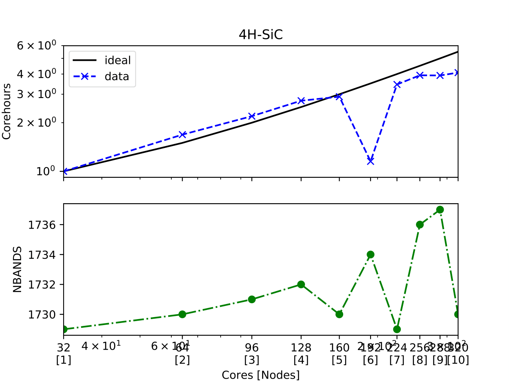
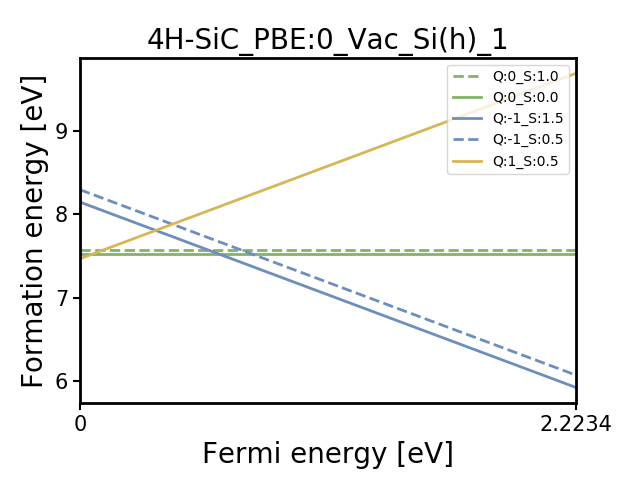
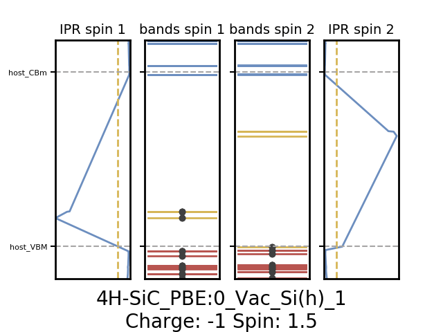

========
Tutorial
========

Introduction
=============

In this tutorial, we will use ADAQ to calculate single defects in 4H-SiC.

Ensure to source *httk* and ADAQ as well as activate the conda environment:

.. code-block:: console

   $ source /path/to/httk/init.shell
   $ source /path/to/ADAQ/init.shell
   $ conda activate adaq

Navigate to where you would like to store the ADAQ project.

.. _project:

ADAQ project
=============

First, create an ADAQ project with the following command:

.. code-block:: console

   $ adaq-set-up-project 4H-SiC

It will prompt you to enter a POSCAR file.
Write the path to the 4H-SiC in ``path/to/ADAQ/test/4H-SiC.vasp``

You will also prompted to provide the dielectric constant (9.6) and refractive_index (2.6473) for 4H-SiC.

You will also prompted to provide meta data about the project, like title (tutorial) and contributors (your name).

This finished the adaq project setup.

The command will also set up a *httk* project.
You will be prompted to set up a public key that identifies you as the owner, which is recommended.

Enter the ``4H-SiC`` folder, and you will see the following folder structure:

.. code-block:: console

   4H-SiC.data  4H-SiC.vasp  defects  full  host  ht.project  parameters.py  screen  tuning  unitcell

.. _supercomputer:

Supercomputer
=========

We must also install a supercomputer for ADAQ and *httk* to interface with.
First, we set up the computer in the ADAQ project:

.. code-block:: console

   $ httk-computer-setup

For this tutorial, we have named the computer ``ht_tetralith``.
If you make a mistake, you restart the config or can edit the ``config`` file in the ``ht.project/computer/ht_tetralith/`` folder.
Once it looks ok, you install *httk* on the supercomputer with the following command:

.. code-block:: console

   $ httk-computer-install <computer name>

If your require to load any modules at the supercomputer, you add them in the ``ht.project/computers/name/start-taskmgr`` file.
For example, add the python module, like this:

.. code-block:: console

   module load Anaconda/2023.09-0-hpc1
   conda activate adaq2

after ``source "\$HTTK_DIR/setup.shell"``.
For more detials, see :doc:`overview`.

.. todo:: 
   export I_MPI_ADJUST_REDUCE=3

Now, everything is set up to continue with the rest of the tutorial.

.. comment setup globel computor or move computer between ADAQ projects : 

Linköping University specifics
------------------------------

To install tetralith, run ``httk-computer-setup`` and fill in the following prompt:

.. code-block:: console

   ==== httk-setup-computer
   Current project: 4H-SiC (/dedur01/data/joeda01/adaq_data/4H-SiC)
   Do you want to setup a project computer (if no, setup a global one) [Y/N]
   Y   
   ==== Setting up computer in /dedur01/data/joeda01/adaq_data/4H-SiC/ht.project/computers//

   The following templates exist:
   local  local-slurm  ssh-slurm
   Choose one:
   ssh-slurm

   Name of new computer?
   ht_tetralith

   Below will follow a series of questions to configure this computer.
   If you answer any wrong, you can go through these questions again
   and change your answers by:
   httk-computer-reconfigure ht_tetralith

   Remote hostname: [supercomputer.example.com]
   tetralith.nsc.liu.se
   Username: [my_login_name]
   x_abcde
   Directory on remote host to keep runs and httk files: [Httk-runs]
   /proj/theophys/users/x_abcde/httk
   Command to run vasp: [mpirun /path/to/your/vasp]
   mpprun /software/sse/manual/vasp/5.4.4.16052018/nsc2/vasp_std
   Vasp pseudopotential path (should be an absolute path, starting with / ): [/path/to/pseudopotential/library]
   /software/sse/manual/vasp/POTCARs/PBE/2015-09-21/
   Slurm project to submit jobs to: [liu1]
   naiss2023-3-2
   Slurm job timeout [6-23:59:59]
   168:00:00
   Taskmanager timeout max time per task in seconds: [3600]
   604800

   New computer configuration added in: /dedur01/data/joeda01/adaq_data/4H-SiC/ht.project/computers///ht_tetralith
   Reminder: if you regret any of your answers
   just run httk-computer-reconfigure ht_tetralith

   Otherwise, if all is fine, you should now run:
   httk-computer-install ht_tetralith

This command will give the following content in the ``ht.project/computer/ht_tetralith/config`` file:

.. code-block:: console
   
   REMOTE_HOST="tetralith.nsc.liu.se"
   REMOTE_HTTK_DIR="/proj/theophys/users/x_abcde/httk"
   USERNAME="x_abcde"
   VASP_COMMAND="mpprun /software/sse/manual/vasp/5.4.4.16052018/nsc2/vasp_std"
   VASP_PSEUDO_PATH="/software/sse/manual/vasp/POTCARs/PBE/2015-09-21/"
   SLURM_PROJECT="naiss2023-3-2"
   SLURM_NODES="1"
   SLURM_TIMEOUT="168:00:00"
   TASKMGR_JOB_TIMEOUT="604800"

Install the computer with:

.. code-block:: console

   $ httk-computer-install ht_tetralith

.. _workflow:

ADAQ workflows
=========

Now we are ready to use the ADAQ workflows; for details see :doc:`workflow`.
Run the ADAQ commands in the ADAQ project.

.. note::

   If you ever get lost during the tutorial, write ``adaq-next-step`` in the ADAQ project to show you how to proceed.

.. _unit:

Relax unit cell
---------------

The first step is to relax the unit cell using the ADAQ workflow.
This workflow will store data in the ``unitcell`` folder.
If something goes wrong, empty the unitcell folder to reset.
You may also need to remove files at the supercomputer, see :doc:`troubleshooting` for more details.

This step will also make you more familiar with the *httk*.
To make the *httk* task that relaxes the unit cell, use the following command:

.. code-block:: console

   $ adaq-workflow-relax-unitcell setup ht_tetralith

There is now a task (``ht.task.ht_tetralith--unitcell.4H-SiC_pbe.start.0.unclaimed.3.waitstart``) in the ``unitcell`` folder.
To send this task to the supercomputer, run:

.. code-block:: console

   $ adaq-workflow-relax-unitcell send ht_tetralith

Optional: you can verify that the task is at the supercomputer (``/path/to/httk/Runs/unitcell/ht.waitstart/3/4H-SiC/unitcell``).
To start the job, run:

.. note::

   When setting up the computer, we set the wall time to maximum which is relevant for the long screening workflow.
   However, the relax unit cell workflow is much faster.
   To avoid waiting long wait time in the queue, in``ht.project/computer/ht_tetralith/config`` edit to SLURM_TIMEOUT="01:00:00"

.. code-block:: console

   $ adaq-workflow-relax-unitcell run ht_tetralith
   
This will start a slurm job at the supercomputer.

Once the slurm job (also referred to as taskmanager) has finished the calculations at the supercomputer.
To receive the finished task, run:

.. code-block:: console

   $ adaq-workflow-relax-unitcell receive ht_tetralith
   
If everything worked correctly, you should now have a finished task (``ht.task.ht_tetralith--unitcell.4H-SiC_pbe.start.0.unclaimed.3.finished``) in the ``unitcell`` folder.
The ADAQ workflow to relax the unit cell is now finished, and we can proceed to generate the defects.

.. _defects:

Generate defects
---------------

The defect generation is done locally in the ADAQ folder.
This step will store data in the ``defect`` folder.
If something goes wrong, empty this folder to reset.

There are a few parameters one needs to set up before starting the defect generation.
These are located in the ``parameter.py`` file; for details see :doc:`commands`.
The default content looks like this:

.. code-block:: python

   '''
   Parameters used in defect generation
   '''

   # If layered structure, have the layers in (c) z-dir and define the staking sequence. Otherwise empty list.
   stacking_sequence = []
   #stacking_sequence = [[[0.0, 0.22], 'h'], [[0.22, 0.47], 'k'], [[0.47, 0.72], 'h'], [[0.72, 0.97], 'k'], [[0.97, 1.0], 'h']]

   # Minimum distance between defects in angstrom, default: 20.0
   minimum_defect_distance = 20.0

   # Select which kind of defects to generate, default: True
   vacancy = True
   substitutional = False
   interstitial = False

   # Which elements to dope with, dopand_string: "intrinsic" (default), "all", or "Intrinsic+spdf"
   # To dope with elements without nuclear spin: "quantum", "quantum_sp" (just s and p quantum elements)
   # one can also manually dope by writing as list: [Si,N]
   dopand_string = "intrinsic"
   #dopand_string = "intrinsic+sp"
   #dopand_string="all"
   #dopand_string="[Si,N]"

   # Is it allowed to mix dopands, like a  H and Li cluster in SiC.
   # If true, only single dopands are allowed   default: True
   only_single_dopands = True

   # How large defect clusters should be, default: 2
   cluster_size = 1

   # Defect distance parameters
   min_distance = 1.0  # in A, min pairwise defect distance, default: 1.0
   max_distance = 3.5  # in A, max pairwise defect distance, default: 3.5
   int_distance = 0.5  # in A, used for generating interstitial positions, default: 0.5
   
We need to change the following:

* Since we have a layered material, we can specify the stacking sequence by layers. Change ``stacking_sequence = []`` to ``stacking_sequence = [[[0.0, 0.22], 'h'], [[0.22, 0.47], 'k'], [[0.47, 0.72], 'h'], [[0.72, 0.97], 'k'], [[0.97, 1.0], 'h']]``
* We want to generate single defects, change ``substitutional`` and ``interstital`` to ``True``.

The rest, we leave as default. Run:

.. code-block:: console

   $ adaq-generate-defects

This will take some time to generate the interstitial positions first then all single defects.
The results are stored in the ``generated.sqlite`` database in the ``defects`` folder.

.. _node:

Node scaling
---------------

After we have generated the defect, we need to optimize the number of nodes to run the defect calculations with.
This is done with the node scaling workflow.
This step will store the number of nodes (``nodes_ht_tetralith.txt``) and the ``NBANDS`` tag (``nodes_ht_tetralith_nbands.txt``) in the ``ht.project/adaq/`` folder that are used for all defect calculations.
If something goes wrong, remove these files to reset.
You may also need to remove files at the supercomputer, see :doc:`troubleshooting` for more details.

To test 10 different nodes, use the following command:

.. code-block:: console

   $ adaq-workflow-node_scaling run ht_tetralith 10

This command will set up and send the tasks to the supercomputer and start a taskmanager for each number of nodes.
The tasks are stored in the ``tuning`` folder.
One can monitor the status of the runs with the following command:

.. code-block:: console

   $ adaq-workflow-node_scaling status ht_tetralith

Once everything is finished, collect the results with the following command:

.. code-block:: console

   $ adaq-workflow-node_scaling collect ht_tetralith

To plot the scaling, run the following command:

.. code-block:: console

   $ adaq-workflow-node_scaling result ht_tetralith

This command will write the following output:

.. code-block:: console

   times:  [0.43777777777777777, 0.2594444444444444, 0.19944444444444445, 0.16, 0.1511111111111111, 0.37972222222222224, 0.12694444444444444, 0.11138888888888888, 0.11166666666666666, 0.10722222222222222]
   NBANDS:  [1729, 1730, 1731, 1732, 1730, 1734, 1729, 1736, 1737, 1730]
   Ideal speed up:  [1.0, 1.5, 2.0, 2.5, 3.0, 3.5, 4.0, 4.5, 5.0, 5.5]
   Bands per cores:  [54.03125, 27.03125, 18.03125, 13.53125, 10.8125, 9.03125, 7.71875, 6.78125, 6.03125, 5.40625]
   Rounded NBANDS:  [1728, 1728, 1728, 1792, 1760, 1728, 1792, 1792, 1728, 1600]
   Close figure after deciding the number of nodes.

And produce the this plot:

In the upper plot, one sees the number of corehours per number of ``Cores [Nodes]``.
Here, the data matches the ideal scaling up to 5 nodes.
Remember this number: once you close the figure, you will enter this value as seen in the code below.
There is a big dip for 6, and the higher nodes deviate from the ideal scaling.
In the lower plot is the ``NBANDS`` tag per number of ``Cores [Nodes]``.
Once the number of nodes is selected, the rounded NBANDS will be stored and used for all defect calculation.
This ensures that the number of bands are equally distributed over the cores.

.. code-block:: console

   Enter chosen nodes: 5
   NBANDS 1760 written to file
   SLURM_NODES written to file

Now, the number of nodes is selected for all defect runs.

.. _host:

Host supercell
---------------

The next step is to calculate the required properties of the host supercell.
This workflow will store data in the ``host`` folder.
If something goes wrong, empty this folder to reset.
You may also need to remove files at the supercomputer, see :doc:`troubleshooting` for more details.

This workflow and commands work similarly to the unit cell workflow.
Run the following commands:

.. code-block:: console

   $ adaq-workflow-calculate-host setup ht_tetralith
   $ adaq-workflow-calculate-host send ht_tetralith
   $ adaq-workflow-calculate-host run ht_tetralith
   $ adaq-workflow-calculate-host receive ht_tetralith

.. _screen:

Screen
---------------

Now, we can get to the main part of ADAQ, calculating the single point defects.
This workflow will store data in the ``screen`` folder.
If something goes wrong, empty this folder to reset.
You may also need to remove files at the supercomputer, see :doc:`troubleshooting` for more details.

This workflow and commands work similarly to the unit cell and host workflow, but we will go through some extra steps here.
Run the following command:

.. code-block:: console

   $ adaq-workflow-screen-defects setup ht_tetralith

This will set up multiple tasks in the ``screen`` folder.
It will also produce a ``lookup`` table that reduces the defect id to a int.
This is done to reduce the total length of the path because some versions of VASP can only handle an absolute path shorter than 240 characters.
The command ``adaq-lookup screen display`` shows the renaming.
After this step, calculate the tasks like before with the following:

.. note::

   If you editted ``ht.project/computer/ht_tetralith/config`` in the relax unit cell workflow.
   Rememeber to edit back SLURM_TIMEOUT="168:00:00"

.. code-block:: console

   $ adaq-workflow-screen-defects send ht_tetralith
   $ adaq-workflow-screen-defects run ht_tetralith
   $ adaq-workflow-screen-defects receive ht_tetralith

After everything has finished, run the following command to rename all defects to their original id: 

.. code-block:: console

   $ adaq-lookup screen rename

Now you have screened the single defects in 4H-SiC.
To view the results, we shall now make a database.

.. note::

   It is also possible to check if there are any faulty task that slipped through. Use ``adaq-workflow-screen-defects check ht_tetralith``.

.. _database:

Build database
---------------

Let us create a database with all the results.
This workflow will make the ``defects.sqlite`` file.

The following command will create the database (and remove older versions):

.. code-block:: console

   $ adaq-rebuild-database light

The argument ``light``, skip storing the relaxed structures to speed up the generation of the database.
The first time this command runs, it will generate a manifest for all tasks.
This will take some time.

After the database has finished, we can look more closely at specific defects.
For example, the silicon vacancy that has the defect id: ``-6977328512552031545``.
To plot the formation energy for this defect, run:

.. code-block:: console

   $ adaq-database-plot-formation-energy -6977328512552031545

which produces a formation energy plot like this:

Here, one sees that the negative charge (-1) state has spin 1.5.
To plot the eigenvalues for this charge and spin state, run:

.. code-block:: console

   $ adaq-database-plot-eigenvalues -6977328512552031545 screen -1 1.5

which produces an eigenvalue plot like this:

One can also add more sophisticated searches based on various properties...

.. todo::

   find script or web interface....

